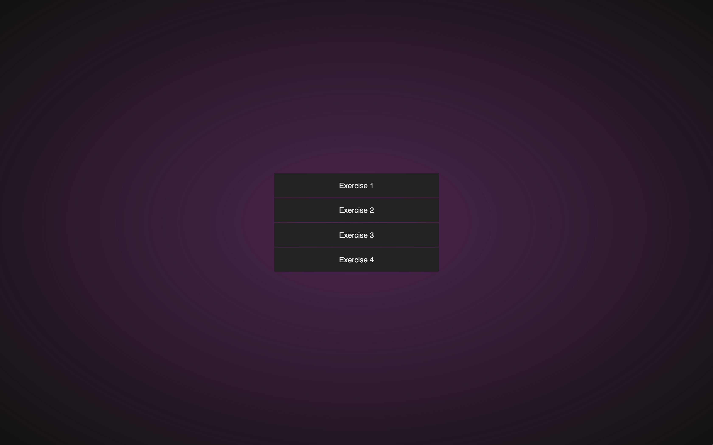
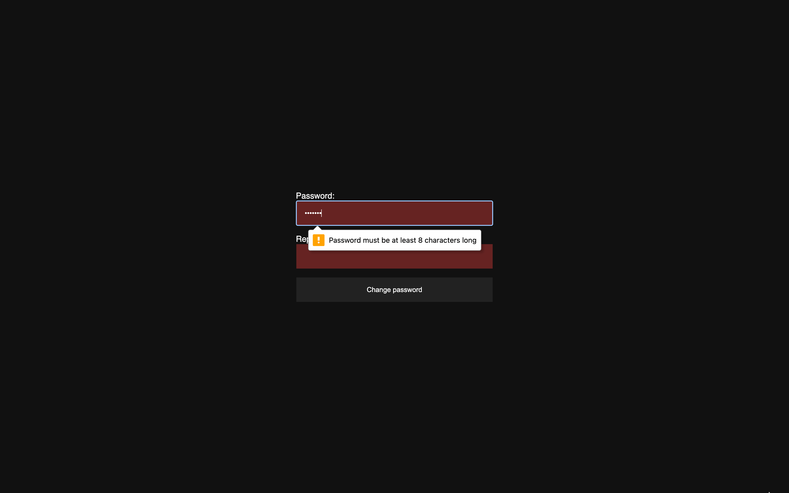
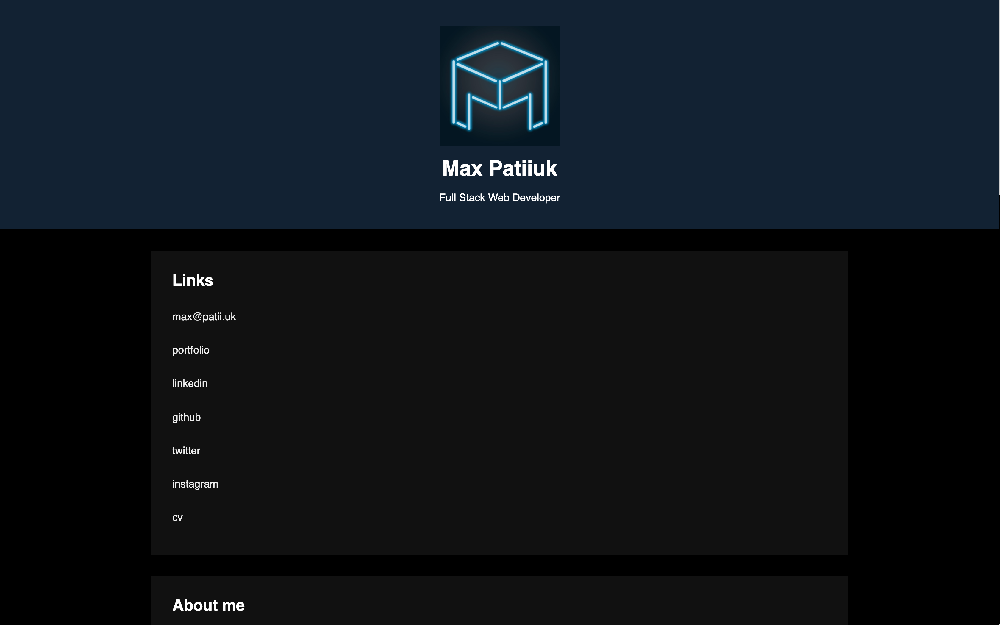
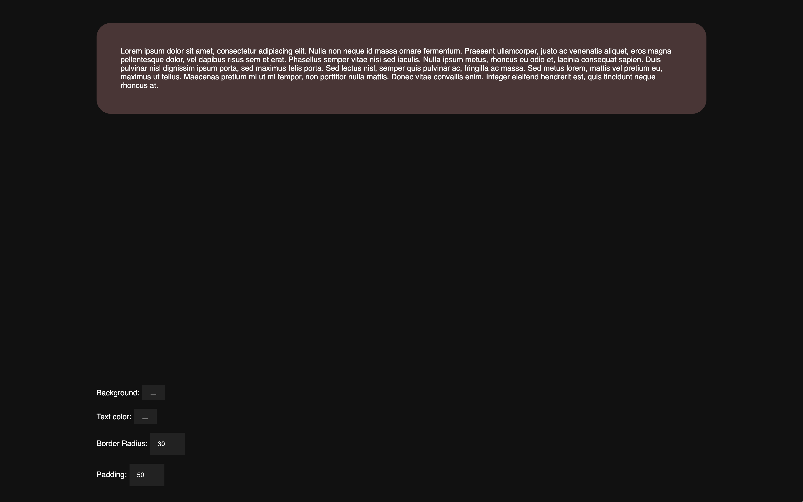

# EECS 448 Lab 08

Embarrassingly basic HTML stuff that I am forced to do for my college classes

## Overview

### Main Menu



### Exercise 1: Form Validation



### Exercise 2: Slider

Credit for images used in the slider goes to
[Melodysheep](https://melodysheep.com).

Horizontal scrolling and on-screen buttons can both be used for changing the
current image.


### Exercise 3: Portfolio



### Exercise 4: WYSIWYG mini-Editor



## Development

```zsh
npm i # install development dependencies
```

Open `./index.html` in your browser.

After making edits, refresh the page

## Production

Open `./index.html` in your browser.
